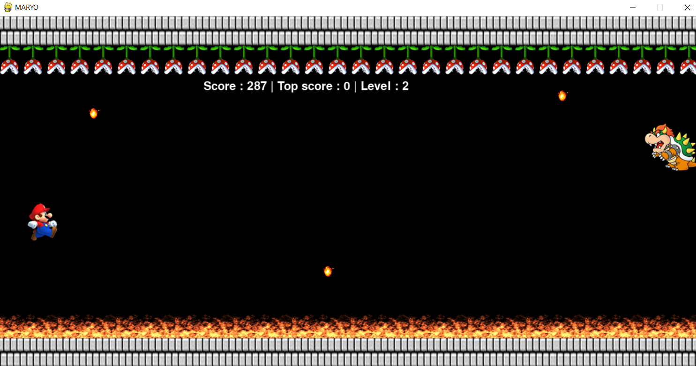

## Maryo

A fun 2D arcade-style game built with the 'pygame' python library. In the game you are Mario and your goal is to avoid Bowser's fireballs by moving your character.

### How to run

-   Install python in your local system
-   open terminal and run `pip install pygame` to install the pygame library
-   Clone/download this repository into your local system
-   open terminal inside Final project directory
-   run `python maryo.py`
-   Use up arrow to move your mario and go for the high score!!

### Preview

### Support Development

   

